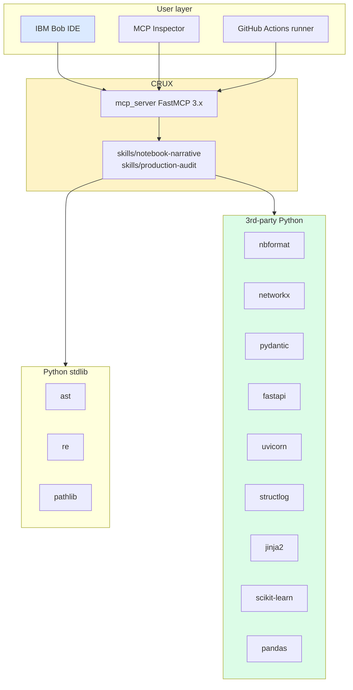

# TECH_STACK.md — every tool, library, and service CRUX uses

> What's in the stack, why it's there, what version, what license. If you find yourself reaching for something not on this list, ask whether it's worth the dependency before adding it.

---

## 1. Languages

| Tool | Version | Why it's here |
|---|---|---|
| **Python** | 3.11+ | The notebook ecosystem is Python. `tomllib` ships in 3.11 (used in pyproject parsing). Type hints from PEP 604 (`X \| Y` syntax) work without `from __future__`. Newer Python features in 3.12+ are not relied on, so 3.11 stays the minimum. |
| **YAML** | spec 1.2 | GitHub Actions workflows, docker-compose files. |
| **Markdown** | CommonMark | All planning docs, all generated dossiers, all SKILL.md and AGENTS.md files. |
| **Mermaid** | 10.x+ | Workflow diagrams in `WORKFLOW_DIAGRAM.md`. Renders in GitHub, GitLab, and Bob. |

---

## 2. Core Python dependencies

These go in `pyproject.toml` under `[project] dependencies`.

| Package | Pinned version | License | Purpose | Phase used |
|---|---|---|---|---|
| `nbformat` | `>=5.10` | BSD-3-Clause | Parse `.ipynb` files into structured Python objects. The official Jupyter package; never roll your own. | 1 |
| `networkx` | `>=3.2` | BSD | Variable lineage graph (DiGraph). Topological sort for ordering load-bearing cells. | 1 |
| `pydantic` | `>=2.7` | MIT | All data models, MCP tool I/O, FastMCP auto-generated schemas, autopatch for input/output validation. | 1, 2, 3 |
| `fastapi` | `>=0.115` | MIT | The generated service template (gap 1, 2, 4 patches). | 2 |
| `uvicorn[standard]` | `>=0.30` | BSD-3-Clause | The ASGI runtime in the generated Dockerfile. | 2 |
| `structlog` | `>=24.1` | MIT/Apache-2.0 dual | Structured logging in the gap-6 autopatch. | 2 |
| `fastmcp` | `>=3.2` | Apache-2.0 | The MCP server framework (jlowin/fastmcp; not the older one bundled inside the official SDK). | 3 |
| `jinja2` | `>=3.1` | BSD-3-Clause | Renders both autopatch templates (`skills/production-audit/patches/*.j2`) and the dossier — including the deterministic stakeholder summary in `templates/stakeholder_summary.md.j2`. | 2, 4 |
| `scikit-learn` | `>=1.5` | BSD-3-Clause | Used only for `ColumnTransformer` detection in gap 3 (train/serve skew). Not a runtime dep of the generated service unless the recovered pipeline uses it. | 2 |
| `pandas` | `>=2.2` | BSD-3-Clause | Parity-test scaffolding (samples 100 rows from training df). | 2 |
| `joblib` | `>=1.4` | BSD-3-Clause | Detect saved-model cells in lineage analysis (`joblib.dump` is one of the terminal-artifact heuristics). | 1 |
| `click` | `>=8.1` | BSD-3-Clause | The `crux` CLI used for `crux audit <notebook>` outside of Bob (and inside the GitHub Actions workflow). | 2, 3 |

### Dev-only

| Package | Version | Purpose |
|---|---|---|
| `ruff` | `>=0.5` | Linting and formatting. Replaces black + flake8 + isort. |
| `pytest` | `>=8` | All tests. |
| `pytest-asyncio` | `>=0.23` | For async MCP tool tests. |
| `httpx` | `>=0.27` | Used in `tests/test_mcp_server.py` to hit the streamable-http transport. |

### What's *not* in the stack (deliberate omissions)

- **No `black`, `flake8`, `isort`** → ruff covers all three, faster.
- **No `requests`** → httpx is fine and async-native.
- **No ORM** → CRUX has no database.
- **No `nbconvert`** → CRUX deliberately doesn't do flat conversion; using nbconvert anywhere would muddy the pitch ("CRUX wraps nbconvert" is exactly the wrong story).
- **No `transformers`, `torch`, `tensorflow`** → CRUX doesn't run models. The audit pipeline is rule-based; the dossier summary is a Jinja2 template. There is no LLM in the runtime path at all.
- **No `ibm-watsonx-ai`, no `openai`, no `anthropic`** → no LLM client libraries. The dossier is a CI artifact and CI artifacts have to be byte-identical across runs; a deterministic template guarantees this, an LLM call cannot. This is a deliberate engineering choice, not a fallback.
- **No `python-dotenv`** → CRUX has no runtime credentials, no `.env` file, no API keys. The only env var read is `CRUX_LOG_LEVEL`, which has a default.
- **No frontend framework** → Bob is the UI.

---

## 3. IBM products and services

| Product | Required? | License/cost | What CRUX uses it for | Doc link |
|---|---|---|---|---|
| **IBM Bob IDE** | **REQUIRED** | Hackathon-provisioned (40 Bobcoins) | Drives the demo, invokes skills, calls the MCP server | https://bob.ibm.com/docs/ide |
| **IBM Bob Shell** | Optional | Same Bobcoin pool | Used during development for non-interactive tasks (e.g., bulk renaming, batch tests). Not in the demo. | https://bob.ibm.com/docs/shell |
| **IBM Cloud** | NOT used | — | CRUX runs entirely on the developer's laptop and in GitHub Actions. No cloud provisioning required. | https://cloud.ibm.com |
| **IBM watsonx.ai / Granite** | NOT used | — | An earlier draft included a Granite-generated stakeholder summary in the dossier. That feature was replaced with a deterministic Jinja2 template (`templates/stakeholder_summary.md.j2`) because the dossier is a CI artifact and CI artifacts must be byte-identical across runs. This is a deliberate engineering decision, not a constraint. | https://www.ibm.com/watsonx |
| **IBM watsonx Orchestrate** | NOT used | — | Out of scope for CRUX. Could be added post-hackathon to wrap the MCP server as an Orchestrate agent. | https://www.ibm.com/products/watsonx-orchestrate |
| **IBM Code Engine** | NOT used | — | The audit's gap 15 detector flags missing Dockerfiles but does not generate cloud-specific deployment manifests. The container image CRUX produces could be deployed to Code Engine, Cloud Run, Fly.io, etc. — that's the user's choice, not CRUX's concern. | https://www.ibm.com/products/code-engine |

### A note on the "no LLM at runtime" decision

The audit pipeline (cell classification, gap detection, autopatching, dossier rendering) contains zero LLM calls. This is deliberate and worth defending in the demo Q&A:

1. **Reproducibility.** A CI gate that produces different verdicts on the same notebook is broken. Rules and templates are reproducible by construction; LLM calls are not.
2. **Cost.** No API budget to manage, no key rotation, no rate limits.
3. **Latency.** The audit runs in <2 seconds end-to-end on a laptop. Granite would add 2–10 seconds per dossier render.
4. **Vendor lock-in.** CRUX runs anywhere Python runs. No watsonx.ai, no OpenAI, no Anthropic dependency.

The LLM *is* in the project — Bob writes the code during the hackathon. That's the right place for the agent to live: in the build process, not in the runtime.

---

## 4. Other free / hackathon-provided tools

| Tool | Cost | What CRUX uses it for |
|---|---|---|
| **GitHub** | Free (public repo) | Source hosting, GitHub Actions runner, PR comments from the gate workflow |
| **GitHub Actions** | Free for public repos | The `ci/block-on-gaps.yml` workflow demo |
| **`act`** | Free (open source) | Local GitHub Actions runner during rehearsal — faster than waiting for real GitHub runners |
| **MCP Inspector** | Free (Anthropic; ships with `mcp dev`) | Live demo of MCP tools surface in wow #3 |
| **`uv`** | Free (Apache-2.0; Astral) | Python project + dependency management. Faster than pip/poetry. |
| **OBS Studio** | Free (GPL) | Recording the demo backup video |
| **`jq`** | Free (MIT) | Parsing MCP responses in the CI workflow |

---

## 5. Sample data

| Source | License | Provenance |
|---|---|---|
| `samples/01_clean.ipynb` | derived from public Kaggle Titanic notebook | CC BY-SA 4.0 (Kaggle terms) |
| `samples/02_messy.ipynb` | derived from public Kaggle House Prices notebook + manually messied | CC BY-SA 4.0 |
| `samples/03_chaos.ipynb` | hand-crafted to stress-test recovery | original work, Apache 2.0 |

All sample notebooks are version-controlled. Per the hackathon data policy:
- ✅ Public, freely licensed
- ✅ No client data
- ✅ No personal information
- ✅ No social-media-derived data

`samples/PROVENANCE.md` records the upstream URL and license for each.

---

## 6. Version pinning strategy

CRUX uses `uv.lock` for fully-pinned reproducible installs. Dev machines run `uv sync` (which respects the lock). The CI workflow runs `uv sync --frozen` (which fails if the lock is out of date — catches accidental drift).

**Major-version bumps require a deliberate update commit** with:
1. Changelog note in the commit message
2. Re-run all tests against the new versions
3. Re-record one demo step with the new versions, in case behavior changed

For the hackathon timeframe, the lock is generated once during Hour 1 and not touched again unless something in Phase 1–4 forces an upgrade.

---

## 7. The `pyproject.toml` (full)

```toml
[project]
name = "crux"
version = "0.1.0"
description = "Code Recovery from Undocumented eXperiments — turn messy notebooks into production services"
readme = "README.md"
requires-python = ">=3.11"
license = { text = "Apache-2.0" }
authors = [{ name = "<your name>" }]
dependencies = [
    "nbformat>=5.10",
    "networkx>=3.2",
    "pydantic>=2.7",
    "fastapi>=0.115",
    "uvicorn[standard]>=0.30",
    "structlog>=24.1",
    "fastmcp>=3.2",
    "jinja2>=3.1",
    "scikit-learn>=1.5",
    "pandas>=2.2",
    "joblib>=1.4",
    "click>=8.1",
]

[project.optional-dependencies]
dev = [
    "ruff>=0.5",
    "pytest>=8",
    "pytest-asyncio>=0.23",
    "httpx>=0.27",
]

[project.scripts]
crux = "skills.production_audit.audit_runner:cli"
crux-mcp = "mcp_server.server:main"

[tool.ruff]
line-length = 100
target-version = "py311"

[tool.ruff.lint]
select = ["E", "F", "I", "N", "UP", "B", "SIM", "RUF"]
ignore = []

[tool.pytest.ini_options]
testpaths = ["tests", "skills"]
addopts = "--tb=short -q"
asyncio_mode = "auto"

[build-system]
requires = ["hatchling"]
build-backend = "hatchling.build"
```

---

## 8. License compliance summary

CRUX itself is **Apache 2.0**. Every dependency above is a permissive license (Apache 2.0, MIT, BSD-2/3-Clause). There are no GPL or LGPL deps — the public submission can be used and forked freely.

Because CRUX has no LLM in its runtime path, there is no model-output provenance question for the audit dossier — every word in the dossier comes from either rule-based detectors or the deterministic Jinja2 template, both of which are auditable in source.

The repo's root `LICENSE` file is the standard Apache 2.0 boilerplate; the `NOTICE` file lists every dependency and its license per Apache 2.0 §4(d).

---

## 9. Stack diagram



---

*If you reach for a tool not on this list during the build, the answer is "no" by default. Add it only after asking: does the demo get better?*
