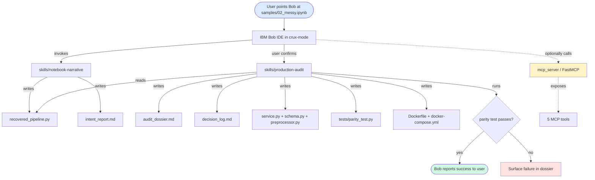
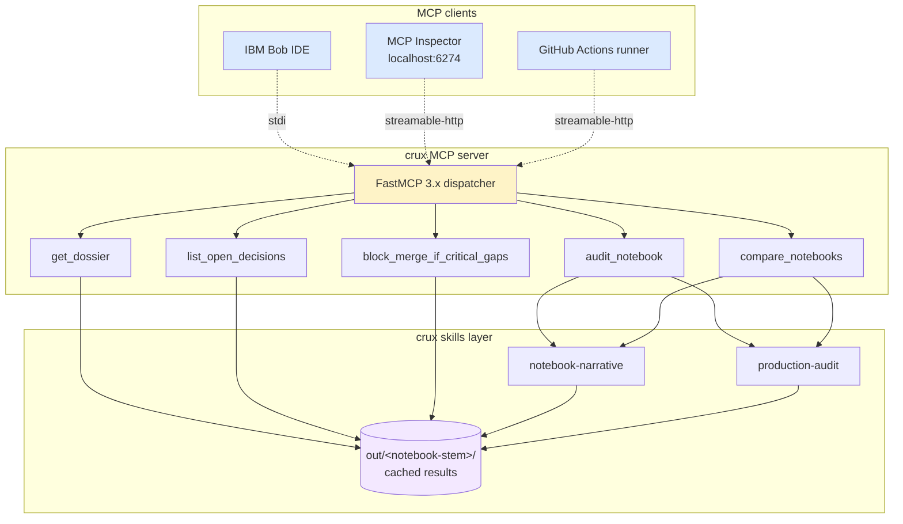
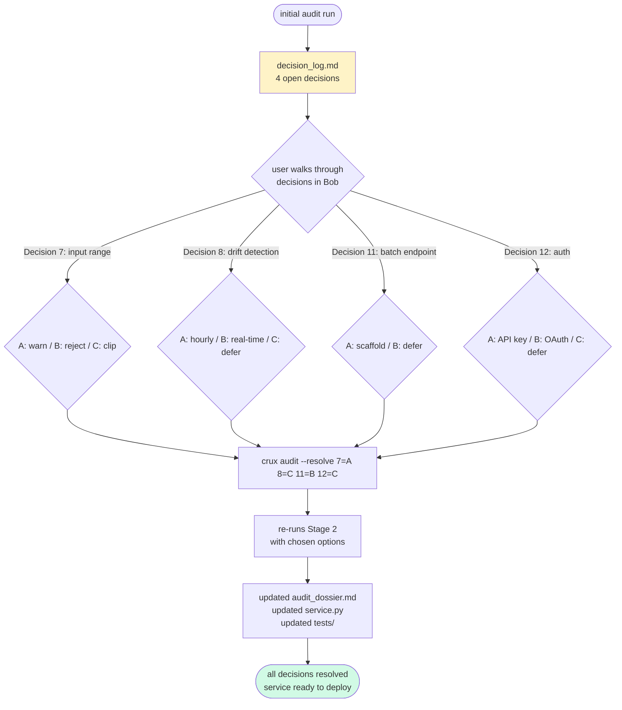
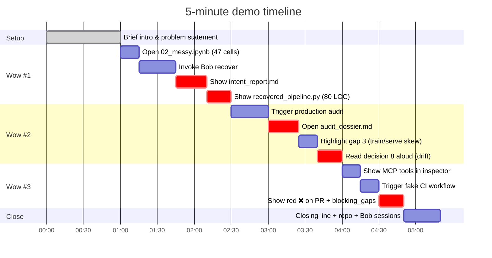
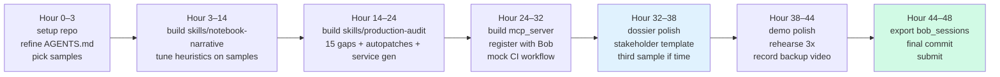
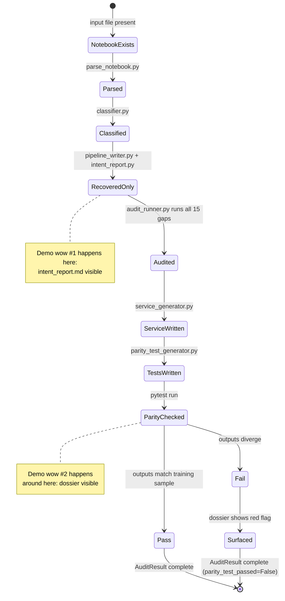
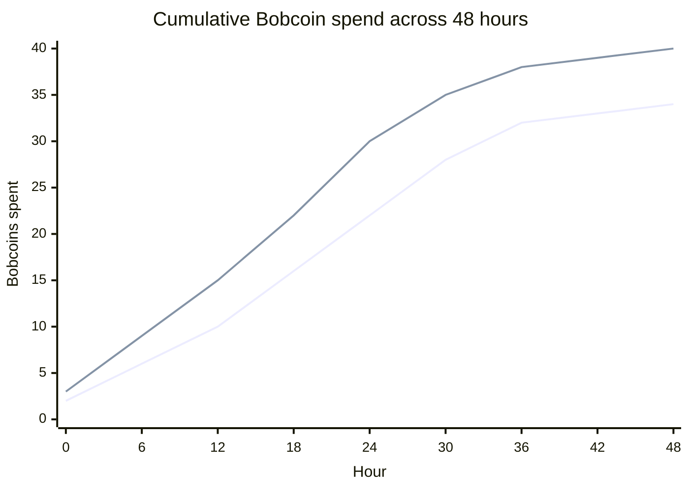
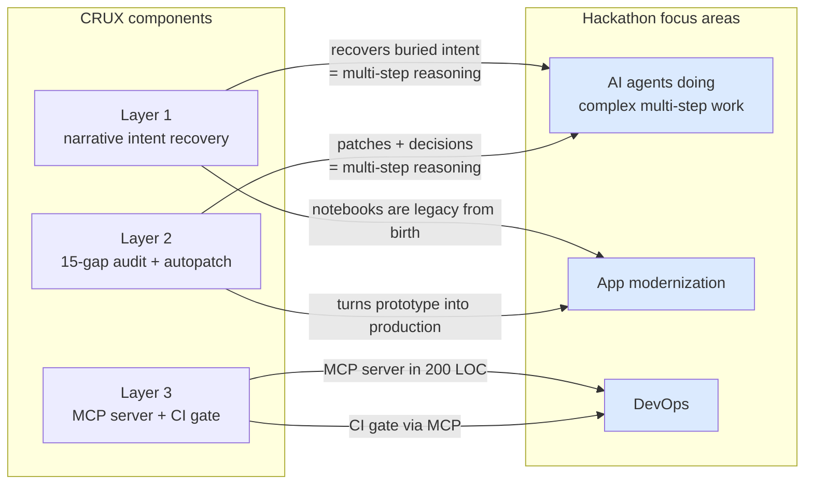

# WORKFLOW_DIAGRAM.md — CRUX flow diagrams

> All diagrams are mermaid. They render natively on GitHub, GitLab, and Bob's Bob Findings panel. If a diagram needs to evolve, edit the mermaid source here and re-render — don't keep parallel PNG copies.

---

## 1. End-to-end: notebook in, deployable service out



---

## 2. Stage 1 detail: narrative intent recovery

```mermaid
flowchart TD
    NB([input.ipynb])
    
    Parse[parse_notebook.py<br/>nbformat → list of Cell]
    Lineage[lineage_graph.py<br/>ast → DiGraph of cell name-flow]
    Score[narrative_scorer.py<br/>regex on markdown_before/after]
    
    NB --> Parse
    Parse --> Lineage
    Parse --> Score
    
    Classify[classifier.py<br/>combine 3 signals]
    
    Lineage --> Classify
    Score --> Classify
    Parse --> Classify
    
    FindTerm{find terminal artifacts<br/>joblib.dump? predict()? last cell?}
    Classify --> FindTerm
    FindTerm --> Trace[trace backward via lineage<br/>cells on a path = load-bearing]
    Trace --> Decide[per-cell label<br/>load-bearing / scaffolding / exploratory / dead<br/>+ confidence]
    
    Decide --> Writer[pipeline_writer.py<br/>topo-sort load-bearing cells<br/>emit recovered_pipeline.py]
    Decide --> Report[intent_report.py<br/>emit intent_report.md]
    
    Writer --> Out1([recovered_pipeline.py])
    Report --> Out2([intent_report.md])
    
    style NB fill:#dbeafe
    style Out1 fill:#d1fae5
    style Out2 fill:#d1fae5
```

---

## 3. Stage 2 detail: 15-gap audit pipeline

```mermaid
flowchart LR
    RP([recovered_pipeline.py])
    NB([original notebook])
    
    Runner[audit_runner.py<br/>orchestrator]
    
    RP --> Runner
    NB --> Runner
    
    subgraph Critical [🔴 critical gaps]
        G1[gap_01_input_validation]
        G2[gap_02_schema_contract]
        G3[gap_03_train_serve_skew]
        G4[gap_04_missing_model]
        G9[gap_09_hardcoded_paths]
    end
    
    subgraph High [🟡 high gaps]
        G5[gap_05_no_versioning]
        G6[gap_06_logging]
        G7[gap_07_input_range]
        G10[gap_10_rate_limit_timeout]
        G12[gap_12_authentication]
        G14[gap_14_no_tests]
        G15[gap_15_no_dockerfile]
    end
    
    subgraph Medium [🟢 medium gaps]
        G8[gap_08_drift_detection]
        G11[gap_11_batch_endpoint]
        G13[gap_13_repro_metadata]
    end
    
    Runner --> Critical
    Runner --> High
    Runner --> Medium
    
    Critical --> Findings[list of Finding]
    High --> Findings
    Medium --> Findings
    
    Findings --> Assemble[assemble dossier<br/>severity-ranked sections]
    Findings --> Decisions[extract decision options]
    Findings --> Patches[apply autopatches]
    
    Assemble --> Out1([audit_dossier.md])
    Decisions --> Out2([decision_log.md])
    Patches --> Out3([service.py, schema.py,<br/>preprocessor.py, Dockerfile, …])
    Patches --> Out4([tests/parity_test.py])
    
    Out4 --> RunTest{pytest passes?}
    RunTest -->|yes| Done([AuditResult.parity_test_passed=True])
    RunTest -->|no| Fail([record failure in dossier])
    
    style RP fill:#dbeafe
    style NB fill:#dbeafe
    style Out1 fill:#d1fae5
    style Out2 fill:#d1fae5
    style Out3 fill:#d1fae5
    style Out4 fill:#d1fae5
    style Critical fill:#fee2e2
    style High fill:#fef3c7
    style Medium fill:#dcfce7
```



---

## 4. The MCP server topology



---

## 5. The CI block-on-gaps flow (DevOps wow moment)

```mermaid
sequenceDiagram
    actor Dev as Data scientist
    participant GH as GitHub
    participant Action as ci/block-on-gaps.yml
    participant MCP as crux MCP server
    participant Out as out/&lt;stem&gt;/

    Dev->>GH: opens PR with changed notebook
    GH->>Action: triggers workflow
    Action->>Action: uv sync, install crux
    Action->>MCP: starts server (background)
    Action->>MCP: audit_notebook(path) via streamable-http
    MCP->>Out: writes audit_dossier.md, decision_log.md
    MCP-->>Action: AuditResult JSON
    Action->>MCP: block_merge_if_critical_gaps(notebook_id)
    MCP->>Out: reads cached AuditResult
    
    alt critical gaps unresolved
        MCP-->>Action: {allow_merge: false, blocking_gaps: [4, 9]}
        Action->>GH: post PR comment with dossier excerpt
        Action->>GH: exit 1 (block merge)
        GH->>Dev: ❌ checks failed
    else clean or only non-critical
        MCP-->>Action: {allow_merge: true, blocking_gaps: []}
        Action->>GH: post PR comment "audit passed"
        Action->>GH: exit 0
        GH->>Dev: ✅ checks passed
    end
```

---

## 6. The decision-log resolution flow



---

## 7. The three demo wow moments (timing)



---

## 8. Build sequence (high-level)



---

## 9. State of artifacts during a run



---

## 10. Bobcoin spend curve (planned vs. risk)



The 6-Bobcoin gap between the planned curve and the 40-Bobcoin ceiling is the **demo-day reserve**. It saves you when the live demo crashes and you need to invoke Bob to fix something on stage.

---

## 11. Component-to-focus-area mapping (for the pitch)



This map is the same one you'll use in the pitch. The brief has three focus areas; CRUX has three layers; each layer hits at least one focus area, with several touching two.

---

*Diagrams should be edited as code, not as images. If a diagram is wrong, fix it here and re-render in your README — don't paste a screenshot back.*
